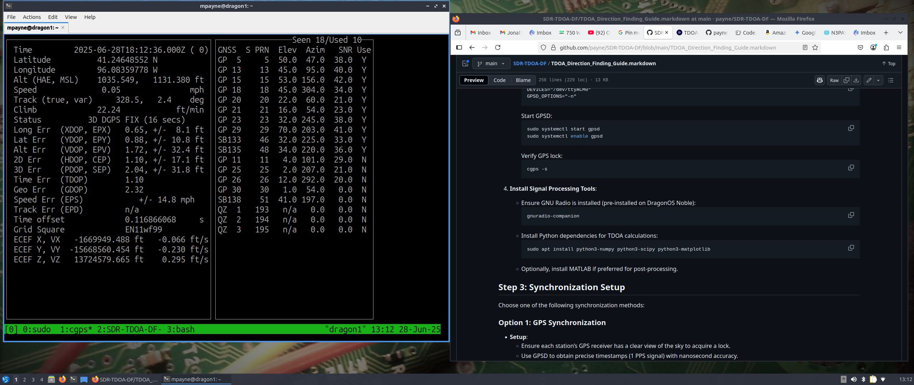
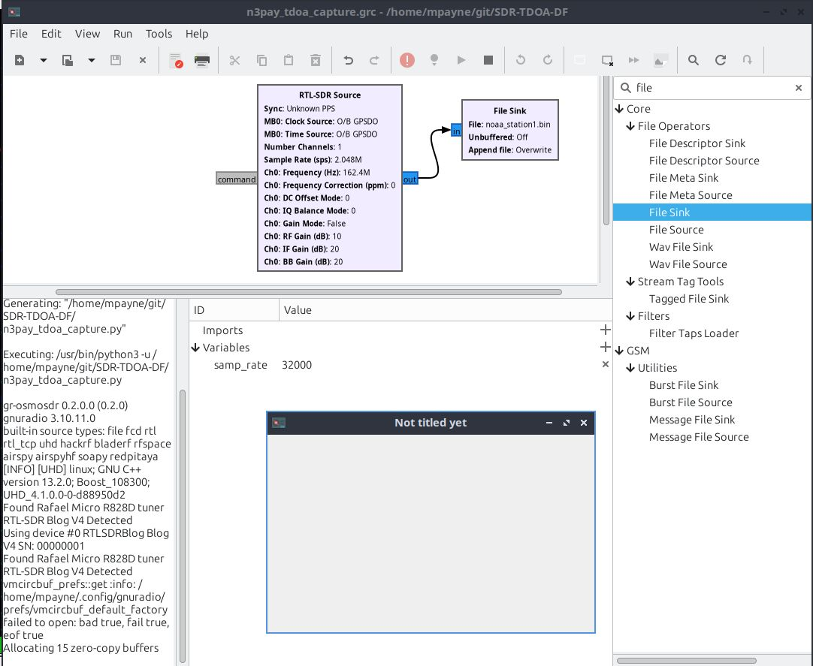

# N3PAY's notes when following the instructions

## `dmesg` after plugging in the RTL-SDR

```
[ 2524.903762] usb 1-2: new high-speed USB device number 7 using xhci_hcd
[ 2525.045569] usb 1-2: New USB device found, idVendor=0bda, idProduct=2838, bcdDevice= 1.00
[ 2525.045592] usb 1-2: New USB device strings: Mfr=1, Product=2, SerialNumber=3
[ 2525.045600] usb 1-2: Product: Blog V4
[ 2525.045605] usb 1-2: Manufacturer: RTLSDRBlog
[ 2525.045610] usb 1-2: SerialNumber: 00000001
root@dragon1:~# 
```

## My output from `rtl_test`


```
Found 1 device(s):
  0:  RTLSDRBlog, Blog V4, SN: 00000001

Using device 0: Generic RTL2832U OEM
Found Rafael Micro R828D tuner
RTL-SDR Blog V4 Detected
Supported gain values (29): 0.0 0.9 1.4 2.7 3.7 7.7 8.7 12.5 14.4 15.7 16.6 19.7 20.7 22.9 25.4 28.0 29.7 32.8 33.8 36.4 37.2 38.6 40.2 42.1 43.4 43.9 44.5 48.0 49.6 
Sampling at 2048000 S/s.

Info: This tool will continuously read from the device, and report if
samples get lost. If you observe no further output, everything is fine.

Reading samples in async mode...
Allocating 15 zero-copy buffers
lost at least 220 bytes
```

I controlled-C (CTRL-C) to get out of `rtl_test`


## dmesg after plugging in the GPS

```
[ 5216.657768] usb 1-4: new full-speed USB device number 8 using xhci_hcd
[ 5216.784815] usb 1-4: New USB device found, idVendor=1546, idProduct=01a7, bcdDevice= 1.00
[ 5216.784837] usb 1-4: New USB device strings: Mfr=1, Product=2, SerialNumber=0
[ 5216.784844] usb 1-4: Product: u-blox 7 - GPS/GNSS Receiver
[ 5216.784849] usb 1-4: Manufacturer: u-blox AG - www.u-blox.com
[ 5216.827866] cdc_acm 1-4:1.0: ttyACM0: USB ACM device
[ 5216.827907] usbcore: registered new interface driver cdc_acm
[ 5216.827910] cdc_acm: USB Abstract Control Model driver for USB modems and ISDN adapters
```


## Start up gpsd

```
root@dragon1:~# vi /etc/default/gpsd 
root@dragon1:~# systemctl start gpsd
root@dragon1:~# systemctl enable gpsd
Synchronizing state of gpsd.service with SysV service script with /usr/lib/systemd/systemd-sysv-install.
Executing: /usr/lib/systemd/systemd-sysv-install enable gpsd
Created symlink /etc/systemd/system/multi-user.target.wants/gpsd.service → /usr/lib/systemd/system/gpsd.service.
root@dragon1:~# 
```

## First run of gnu radio companion

```
mpayne@dragon1:~/git/SDR-TDOA-DF$ gnuradio-companion 
tempest_message_to_var.block.yml         block.parameters[0]: warn: Ignoring extra key 'optional'
<<< Welcome to GNU Radio Companion 3.10.11.0 >>>

Block paths:
        /home/mpayne/.local/state/gnuradio
        /usr/local/share/gnuradio/grc/blocks
mpayne@dragon1:~/git/SDR-TDOA-DF$ 
```

## First time running Option 2 `rtl_sdr`

```
mpayne@dragon1:~/git/SDR-TDOA-DF$ rtl_sdr -f 162400000,174309000 -s 2048000 output.bin
Found 1 device(s):
  0:  RTLSDRBlog, Blog V4, SN: 00000001

Using device 0: Generic RTL2832U OEM
Found Rafael Micro R828D tuner
RTL-SDR Blog V4 Detected
Sampling at 2048000 S/s.
Tuned to 162400000 Hz.
Tuner gain set to automatic.
Reading samples in async mode...
Allocating 15 zero-copy buffers
rtlsdr_demod_write_reg failed with -6
rtlsdr_demod_read_reg failed with -6
r82xx_write: i2c wr failed=-6 reg=17 len=1
r82xx_set_freq: failed=-6
rtlsdr_demod_write_reg failed with -6
rtlsdr_demod_read_reg failed with -6
WARNING: Failed to set center freq.
rtlsdr_demod_write_reg failed with -6
rtlsdr_demod_read_reg failed with -6
r82xx_write: i2c wr failed=-6 reg=17 len=1
r82xx_set_freq: failed=-6
rtlsdr_demod_write_reg failed with -6
rtlsdr_demod_read_reg failed with -6
WARNING: Failed to set center freq.

User cancel, exiting...
mpayne@dragon1:~/git/SDR-TDOA-DF$ 
```


## After unplugging the GPS `dmesg` says:

```
[ 6679.609786] usb 1-4: USB disconnect, device number 8
```


## Put different GPS in (this one has longer cord):

```
[ 6679.609786] usb 1-4: USB disconnect, device number 8
[ 6754.233488] usb 1-4: new full-speed USB device number 9 using xhci_hcd
[ 6754.362468] usb 1-4: New USB device found, idVendor=1546, idProduct=01a7, bcdDevice= 1.00
[ 6754.362490] usb 1-4: New USB device strings: Mfr=1, Product=2, SerialNumber=0
[ 6754.362497] usb 1-4: Product: u-blox 7 - GPS/GNSS Receiver
[ 6754.362503] usb 1-4: Manufacturer: u-blox AG - www.u-blox.com
[ 6754.366539] cdc_acm 1-4:1.0: ttyACM0: USB ACM device
root@dragon1:~# 
```

## `cgps -s` looking like I have GPS lock




## With RTL-SDR closer to the window

```
mpayne@dragon1:~/git/SDR-TDOA-DF$ rtl_sdr -f 162400000,174309000 -s 2048000 output.bin
Found 1 device(s):
  0:  RTLSDRBlog, Blog V4, SN: 00000001

Using device 0: Generic RTL2832U OEM
Found Rafael Micro R828D tuner
Sampling at 2048000 S/s.
[R82XX] PLL not locked!
Tuned to 162400000 Hz.
Tuner gain set to automatic.
Reading samples in async mode...
[R82XX] PLL not locked!
Tuned to 100000000 Hz.
[R82XX] PLL not locked!
Tuned to 162400000 Hz.

User cancel, exiting...
```

## First guess at a flowgraph in gnuradio companion

This created a large `.bin` file:
```
-rw-rw-r-- 1 mpayne mpayne 2.0G Jun 28 14:26 noaa_station1.bin
```

And it created a python file!  So cool.

```
-rw-rw-r-- 1 mpayne mpayne 8388 Jun 28 14:25 n3pay_tdoa_capture.grc
-rwxrwxr-- 1 mpayne mpayne 4433 Jun 28 14:24 n3pay_tdoa_capture.py
```



## `rtl_sdr` to capture both frequencies

```
mpayne@dragon1:~/git/SDR-TDOA-DF$ rtl_sdr -f 162400000,174309000 -s 2048000 both_freq_output.bin
Found 1 device(s):
  0:  RTLSDRBlog, Blog V4, SN: 00000001

Using device 0: Generic RTL2832U OEM
Found Rafael Micro R828D tuner
Sampling at 2048000 S/s.
[R82XX] PLL not locked!
Tuned to 162400000 Hz.
Tuner gain set to automatic.
Reading samples in async mode...
[R82XX] PLL not locked!
Tuned to 100000000 Hz.
[R82XX] PLL not locked!
Tuned to 162400000 Hz.

User cancel, exiting...
mpayne@dragon1:~/git/SDR-TDOA-DF$ echo $?
0
mpayne@dragon1:~/git/SDR-TDOA-DF$ ls -lht bo*bin
-rw-rw-r-- 1 mpayne mpayne 12M Jun 28 19:49 both_freq_output.bin
mpayne@dragon1:~/git/SDR-TDOA-DF$ 
```
